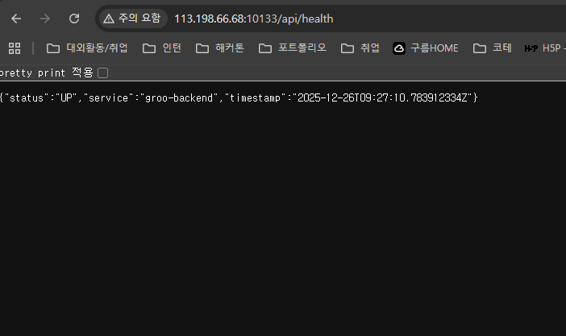

# GROO (Collaboration Platform) — Term Project

실험실/연구실 협업을 위한 **그룹·프로젝트·태스크 관리** 웹 서비스입니다.  
프런트(Vite) + 백엔드(Spring Boot) + MySQL/Redis를 Docker Compose로 한 번에 실행할 수 있도록 구성했습니다.

---

## 1) 프로젝트 개요

### 문제정의
- 연구실 내 할 일/프로젝트/그룹(워크스페이스)가 분산(메신저/메모/캘린더)되어 관리가 어렵다.
- 계정/권한/그룹 단위 협업과 태스크 진행 현황을 **단일 워크플로**로 통합한다.

### 주요 기능
- 인증/인가: 이메일 회원가입/로그인, JWT(Access/Refresh), RBAC(ROLE_USER/ROLE_ADMIN)
- 그룹(워크스페이스): 그룹 생성/조회/수정/삭제, 멤버 관리
- 프로젝트/태스크: 프로젝트/태스크 CRUD, 서브태스크/댓글/활동 로그(구현된 범위 내)
- 공통 요구사항: 페이지네이션/검색/정렬, 입력 검증, 에러 응답 포맷 통일
- 인프라: MySQL + Flyway 마이그레이션/시드, Redis(예: 레이트리밋/토큰 블랙리스트 등)
- 문서: Swagger UI, Postman Collection

---

## 2) 실행 방법

### 로컬(개발) 실행
#### 프런트
```bash
npm install
npm run dev
```
- 기본: `http://localhost:5173`

#### 백엔드
```bash
cd backend
./gradlew bootRun
```
- 기본: `http://localhost:8080`

> 로컬에서 프런트가 백엔드를 호출하려면 CORS 허용 도메인(`CORS_ALLOWED_ORIGINS`)에 `http://localhost:5173`을 포함해야 합니다.

### Docker Compose (로컬/서버 공통)
```bash
cp .env.example .env
docker compose up -d --build
```

---

## 3) 환경변수(.env.example와 매칭)

### 프런트(Vite)
- `VITE_FIREBASE_*`: Firebase SDK 설정(프런트에서 사용)
- `VITE_API_BASE_URL`: API Base URL
  - 권장: 빈 값(기본) + 프런트에서 `/api/...`로 호출 → Nginx 프록시 사용

### 백엔드(Spring Boot)
- `DB_URL`, `DB_USERNAME`, `DB_PASSWORD`: MySQL 연결
- `REDIS_HOST`, `REDIS_PORT`: Redis 연결
- `JWT_SECRET`: JWT 서명 키(최소 256-bit 이상 권장)
- `CORS_ALLOWED_ORIGINS`: 허용 Origin 목록(콤마로 구분)
- `RATE_LIMIT_ENABLED`, `RATE_LIMIT_WINDOW_SECONDS`, `RATE_LIMIT_MAX_REQUESTS`: 전역 레이트리밋 설정(구현된 범위 내)

### Docker 포트 매핑(호스트)
- `HOST_FRONT_PORT`: 프런트 노출 포트(서버 외부 포워딩 대상)
- `HOST_DB_PORT`, `HOST_REDIS_PORT`: 필요 시 로컬/서버에서 직접 접속할 때 사용하는 호스트 포트

---

## 4) 배포 주소

- Base URL: `http://113.198.66.68:10133/`
- API Root: `http://113.198.66.68:10133/api`
- Swagger UI: `http://113.198.66.68:10133/swagger-ui/index.html`
- Health: `http://113.198.66.68:10133/api/health`



---

## 5) 인증 플로우

### 이메일 로그인
1. `POST /api/auth/register` 또는 `POST /api/auth/login`
2. 응답으로 `accessToken`, `refreshToken` 발급
3. 이후 보호 API 호출 시 `Authorization: Bearer <accessToken>`
4. `accessToken` 만료 시 `POST /api/auth/refresh`로 재발급
5. `POST /api/auth/logout`으로 로그아웃(Refresh 폐기 + 블랙리스트 등 적용 범위 내)

### 소셜 로그인(구현)
- 백엔드 엔드포인트:
  - `POST /api/auth/google` (Google idToken)
  - `POST /api/auth/firebase` (Firebase idToken)
- 프런트: Google 로그인 버튼만 제공
- Firebase 로그인: API는 열려있지만 UI에서는 숨김(필요 시 Postman으로 검증)

---

## 6) 역할/권한표(RBAC)

| 구분 | 예시 엔드포인트 | 권한 |
| --- | --- | --- |
| 공개 | `/api/health`, `/api/auth/**`, `/swagger-ui/**`, `/v3/api-docs/**` | 누구나 |
| 인증(일반) | `/api/users/me`, `/api/groups/**`, `/api/projects/**`, `/api/tasks/**` | `ROLE_USER` 이상 |
| 관리자 | `/api/admin/**` | `ROLE_ADMIN` |

---

## 7) 예제 계정(시드 기준)

> 시드가 적용된 DB에서만 동작합니다.

- 관리자: `seed01@groo.local` / `SeedUser123!`
- 사용자: `seed02@groo.local` / `SeedUser123!`

---

## 8) DB 연결 정보(테스트/개발용)

### MySQL
[MySQL 접속 정보]
- Host: localhost
- Port: 3306
- Database: groo
- Username: groo
- Password: groo

[MySQL 접속 명령어]
- mysql -u groo -p -h localhost -P 3306 groo


### Redis
[Redis 접속]
- Redis Host: localhost
- Redis Port: 6380
- Redis 접속 명령어: redis-cli -h localhost -p 6380

---

## 9) 엔드포인트 요약표(일부)

| URL | Method | 설명 |
| --- | --- | --- |
| `/api/health` | GET | 헬스체크 |
| `/api/auth/register` | POST | 회원가입(이메일) |
| `/api/auth/login` | POST | 로그인(이메일) |
| `/api/auth/refresh` | POST | 토큰 재발급 |
| `/api/auth/logout` | POST | 로그아웃 |
| `/api/auth/google` | POST | Google 소셜 로그인(idToken) |
| `/api/auth/firebase` | POST | Firebase 소셜 로그인(idToken) |
| `/api/users/me` | GET | 내 정보 |
| `/api/groups` | GET | 그룹 목록 |
| `/api/groups/search` | GET | 그룹 검색 |
| `/api/groups` | POST | 그룹 생성 |
| `/api/groups/{groupId}` | GET | 그룹 상세 |
| `/api/groups/{groupId}` | PUT | 그룹 수정 |
| `/api/groups/{groupId}/members` | GET | 그룹 멤버 목록 |
| `/api/groups/{groupId}/members` | POST | 그룹 멤버 추가 |
| `/api/groups/{groupId}/members/{membershipId}` | DELETE | 그룹 멤버 제거 |
| `/api/groups/{groupId}/invites` | POST | 초대 코드 재발급 |
| `/api/groups/join` | POST | 초대 코드로 가입 |
| `/api/projects?groupId={groupId}` | GET | 프로젝트 목록(그룹 기준) |
| `/api/projects/search` | GET | 프로젝트 검색 |
| `/api/projects` | POST | 프로젝트 생성 |
| `/api/tasks?projectId={projectId}` | GET | 태스크 목록(프로젝트 기준) |
| `/api/tasks/search` | GET | 태스크 검색 |
| `/api/tasks` | POST | 태스크 생성 |
| `/api/tasks/{taskId}` | GET | 태스크 상세 |
| `/api/tasks/{taskId}` | PATCH | 태스크 수정 |
| `/api/tasks/{taskId}/subtasks` | GET | 서브태스크 목록 |
| `/api/tasks/{taskId}/subtasks` | POST | 서브태스크 생성 |
| `/api/tasks/{taskId}/subtasks/{subtaskId}` | PATCH | 서브태스크 수정 |
| `/api/tasks/{taskId}/subtasks/{subtaskId}` | DELETE | 서브태스크 삭제 |
| `/api/tasks/{taskId}/comments` | GET | 댓글 목록 |
| `/api/tasks/{taskId}/comments` | POST | 댓글 작성 |
| `/api/tasks/{taskId}/activity` | GET | 활동 로그 조회 |
| `/api/admin/users` | GET | 관리자: 유저 목록/검색 |
| `/api/admin/users/{id}/roles` | PATCH | 관리자: 권한 변경 |
| `/api/admin/users/{id}/deactivate` | POST | 관리자: 유저 비활성화 |
| `/api/admin/stats/users` | GET | 관리자: 유저 통계 |
| `/api/admin/stats/workload` | GET | 관리자: 워크로드 통계 |

전체 목록은 Swagger UI에서 확인하세요.

---

## 10) Swagger / Postman

### Swagger UI
- `http://113.198.66.68:10133/swagger-ui/index.html`
- 보호 API 호출 시 우측 상단 `Authorize` → `Bearer <accessToken>` 입력

### Postman
- 경로: `postman/` 아래 컬렉션(JSON)
- 환경 변수 예시:
  - `BASE_URL` = `http://113.198.66.68:10133`
  - `ACCESS_TOKEN` (로그인 후 스크립트로 자동 저장)

---

## 11) 보안/성능 고려사항

- 비밀번호 해시(BCrypt 등), JWT 서명키(256-bit 이상), 토큰 만료/재발급
- CORS 제한(허용 Origin만)
- 전역 레이트리밋(구현된 범위 내)
- DB 인덱스/조회 최적화(필요 시 확장)
- 민감정보는 `.env`로 분리하고 레포에 커밋하지 않음

---

## 12) 한계와 개선 계획

- 소셜 로그인(구글)은 토큰 검증을 위해 서버 환경 변수/리다이렉트 설정이 필요하며, 배포 환경에 맞춰 추가 검증/에러 처리 보강 예정
- 실시간 메시지/알림 등은 별도 리소스로 확장 예정
- CI/CD(GitHub Actions), 모니터링(Prometheus/Grafana) 연동 예정
